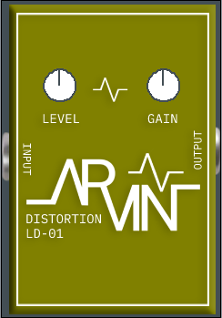

# Arvin-Studio-Distortion-ASIO.1.3-Win
Berikut adalah versi README.md dengan link repositori yang baru:

**Efek Distorsi untuk Plugin VST**



Selamat datang di repositori efek distorsi untuk plugin VST! Efek distorsi ini mengubah sinyal audio dengan mengendalikan jumlah distorsi dan gain pada suara yang dihasilkan. Dengan menggunakan proyek ini, Anda dapat memahami dasar-dasar pengembangan plugin VST dan implementasi efek audio sederhana.

**Cara Menggunakan Plugin**

1. **Prasyarat**

   Pastikan Anda memiliki IDE Delphi dengan komponen pendukung ASIO VST dari Steinberg

2. **Klon Repositori**

   Klon repositori ini ke dalam mesin lokal Anda dengan perintah berikut:

   ```
   git clone https://github.com/arvin-plugin/Arvin-Studio-Distortion-ASIO.1.3-Win.git
   ```

3. **Buka Proyek**

   Buka proyek `Distortion.dpr` menggunakan Delphi IDE.

4. **Kompilasi Proyek**

   Kompilasi proyek untuk menghasilkan plugin VST (`distortion.dll`).

5. **Integrasikan dengan DAW**

   Salin file `distortion.dll` yang dihasilkan dari langkah sebelumnya ke direktori plugin pada aplikasi Digital Audio Workstation (DAW) yang mendukung VST.

6. **Buka DAW**

   Buka DAW dan cari plugin "Distortion" di antara efek-efek yang tersedia.

7. **Atur Parameter**

   Setelah menambahkan efek distorsi ke dalam saluran audio, Anda dapat mengatur parameter distorsi dan gain dengan menggunakan kontrol yang disediakan.

   - Distorsi: Memperkuat atau mengurangi distorsi dengan menggerakkan knob "Distortion Amount".
   - Gain: Mengendalikan level output dengan menggerakkan knob "Gain Amount".

8. **Nikmati Efek Distorsi**

   Nikmati suara distorsi yang dihasilkan oleh plugin VST ini! Eksperimen dengan parameter distorsi dan gain untuk mendapatkan hasil suara yang sesuai dengan preferensi Anda.

**Kontribusi**

Kami senang menerima kontribusi dari komunitas untuk meningkatkan dan memperbaiki plugin ini. Jika Anda memiliki ide untuk peningkatan, silakan buat `fork` repositori ini, lakukan perubahan pada cabang baru, dan ajukan `pull request` untuk revisi.

**Lisensi**

Proyek ini dilisensikan di bawah [MIT License](LICENSE).

**Kontak**

Jika Anda memiliki pertanyaan atau masalah terkait proyek ini, jangan ragu untuk menghubungi kami melalui [issues](https://github.com/arvin-plugin/Arvin-Studio-Distortion-ASIO.1.3-Win/issues) pada repositori ini.

Terima kasih telah menggunakan efek distorsi ini! Semoga bermanfaat untuk kreativitas dan eksplorasi musik Anda.
